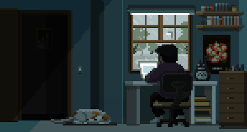

     
    <a href="URL">
        &nbsp;
    </a>
    <a href="https://www.youtube.com/channel/UCOJWPIGBVggT205dw8f3mAQ">
        &nbsp;
    </a>
    <a href="https://t.me/Hassuk1">
        &nbsp;
    </a>
    
    

        

    <h1><b>Hi there, I'm Mikhail 🖐🏻</b></h1>
    

    <h1><b>👨‍💻 About me:</b></h1>
    <h4>I am an aspiring full-stack software developer from Russia/Kazan. I am currently studying at Programming School 21 (@perlabru). In myfree time I study GameDev, in particular Unreal Engine. Here you can find both personal and school projects.</h4>
    <h3><a href="https://drive.google.com/file/d/1VIyPFUE_h43_Il8pA3Y-Yq3wzIJH3-DU/view?usp=sharing"target="_blank">My resume (EN)</a>            <a href="https://drive.google.com/file/d/1onTAN5rzuYnILfrJsxF0g-nGnK6YQJGs/view?usp=sharing"target="_blank">Мое резюме (RU)</a></h3>

    <h1><b>⚙ Language & DevTools</b></h1>
    <h2><b>🤖 Main (Most used):</b></h2>
    &nbsp;
    &nbsp;
    &nbsp;
    &nbsp;
    &nbsp;
    &nbsp;
    &nbsp;
    &nbsp; 
    <h2><b>👽 Alternative (Use it, but less often):</b></h2>
    &nbsp;
    &nbsp;
    &nbsp;
    &nbsp;
    &nbsp;
    &nbsp;
    &nbsp;
    &nbsp;
    &nbsp;
    &nbsp;
    &nbsp; 
    <h2><b>👻 Additional (Rarely use):</b></h2>
    &nbsp;
    &nbsp;
    

    <h1><b>🔥 My stat:</b></h1>
    
     
    

    <h1><b>🔽 Check out my projects.</b></h1>

    
    
    

